## Mermaid

**Mermaid** - это сильно упращенный и далёкий аналог **UML** - специалный язык описании блок-схем, графиков и диаграм с их визуализацией.

### Блок схемы

#### Базовая структура 1
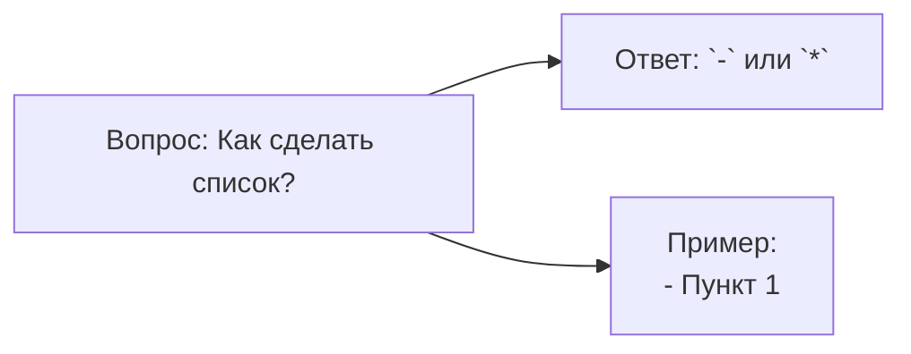
* flowchart - блок-схема
* LR - направление вправо
* A[],B[],C[] - прямоуголник
* --> - стрелка связи
#### Базовая структура 2

#### Полный синтаксис блок-схем

#### Диаграмма последовательности

#### Диаграмма класса

#### Диаграмма Ганта

#### Граф зависимстей

#### Диаграмма состояний

#### Юзер-джайрни

#### Кастомизация стилей

#### Классы CSS

#### Интерактивность

#### Круговая диаграмма

Круговая диаграмма
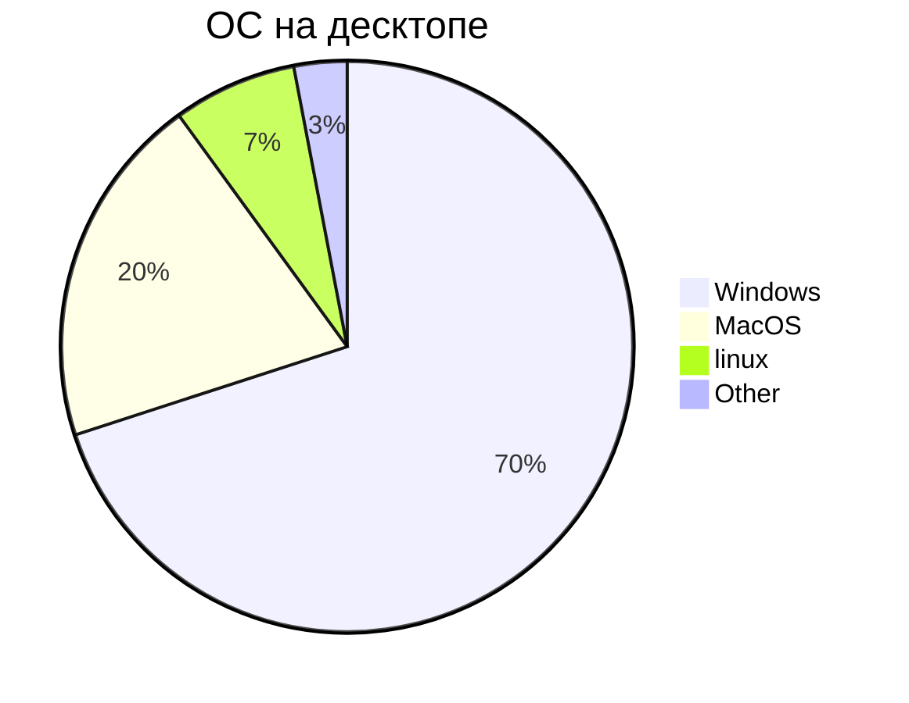

---

## 1. Блок-схемы (Flowcharts)

Блок-схемы используются для визуализации алгоритмов, бизнес-процессов и логики работы программных модулей.

### 1.1 Линейная схема (Горизонтальная)

Схема с направлением слева направо (`LR`).

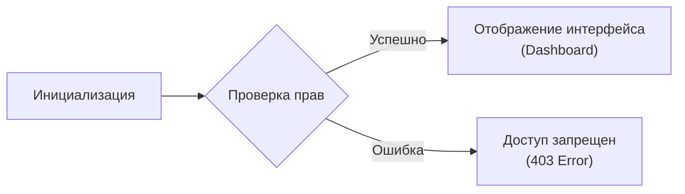

* `flowchart` — задает тип схемы;
* `LR` — порядок отрисовки (Left to Right);
* ` ` — единственный корректный способ переноса строки внутри узлов.

### 1.2 Ветвление и условия (Вертикальная)

Схема с ориентацией сверху вниз (`TD`).

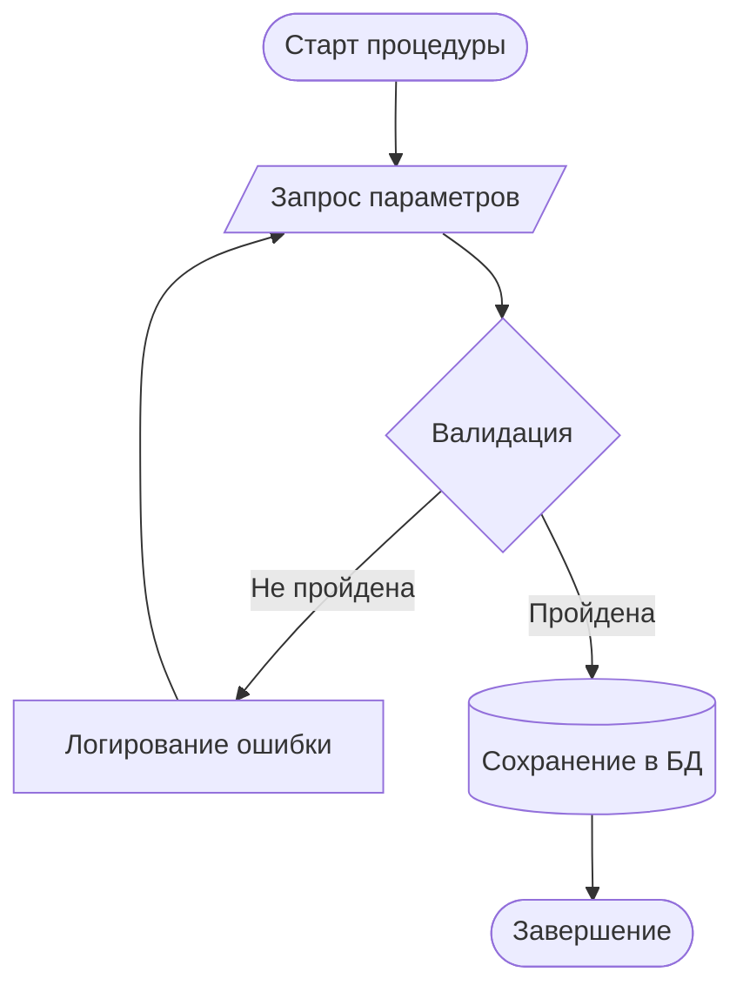

---

### 1.3 Справочник форм узлов

| Код | Внешний вид | Назначение |
| :--- | :--- | :--- |
| `id[Текст]` | Прямоугольник | Стандартный шаг процесса |
| `id(Текст)` | Скруглённые углы | Вспомогательное действие |
| `id([Текст])` | Овал / Стадион | Начальная или конечная точка |
| `id[[Текст]]` | Подпроцесс | Вызов внешнего скрипта / функции |
| `id[(Текст)]` | Цилиндр | База данных или реестр |
| `id((Текст))` | Круг | Точка соединения |
| `id{Текст}` | Ромб | Развилка / Логический оператор |
| `id[/Текст/]` | Параллелограмм | Входные или выходные данные |

---

### 1.4 Группировка блоков (Subgraphs)

Позволяет логически объединять связанные элементы.

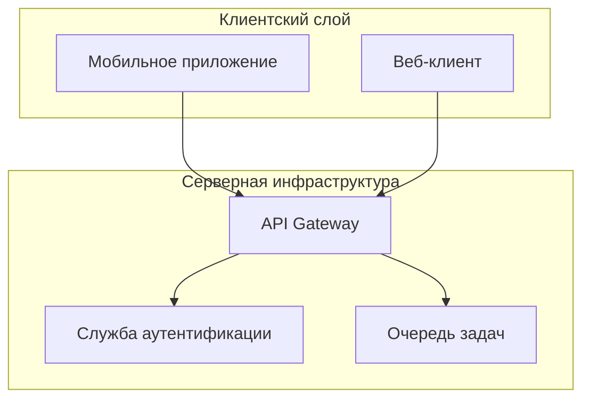

---

## 2. Диаграмма последовательности (Sequence)

Служит для отображения хронологии сообщений и запросов между компонентами системы.

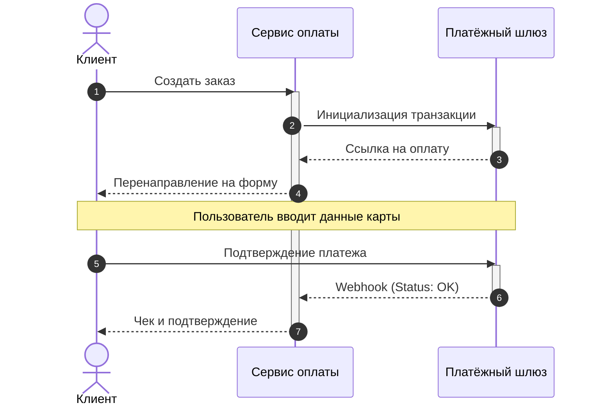

---

## 3. Диаграмма классов (Class Diagram)

Отражает ООП-архитектуру: классы, методы, поля и связи между ними.

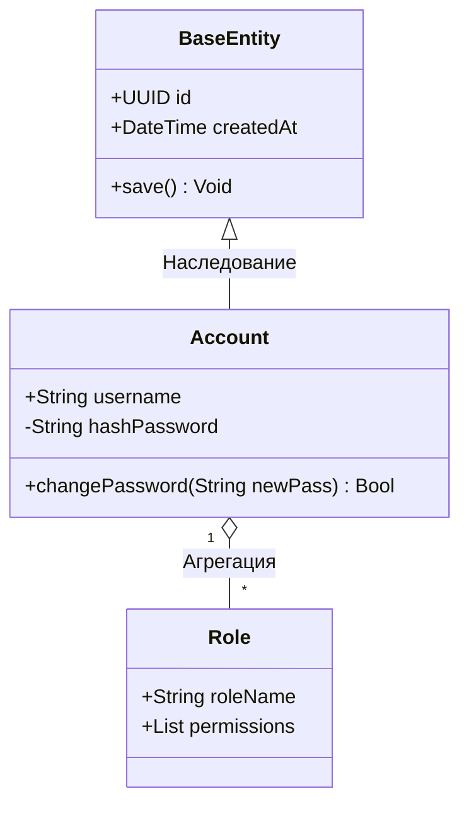

* Модификаторы доступа: `+` Public, `-` Private, `#` Protected.
* Обозначения связей: `<|--` (Inheritance), `o--` (Aggregation), `*--` (Composition).

---

## 4. Диаграмма Ганта (Gantt Chart)

Удобна для визуализации дорожных карт проектов и отслеживания дедлайнов.

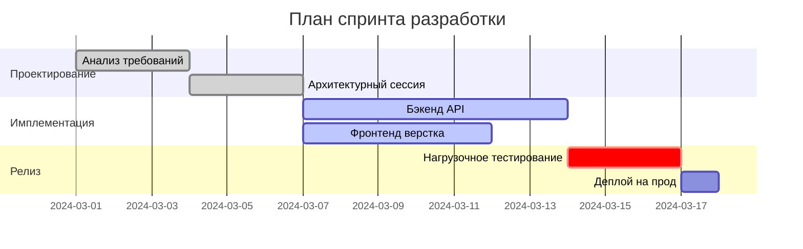

---

## 5. Граф зависимостей компонентов

Выстраивается с помощью `flowchart` для наглядного отображения архитектуры модулей или библиотек.

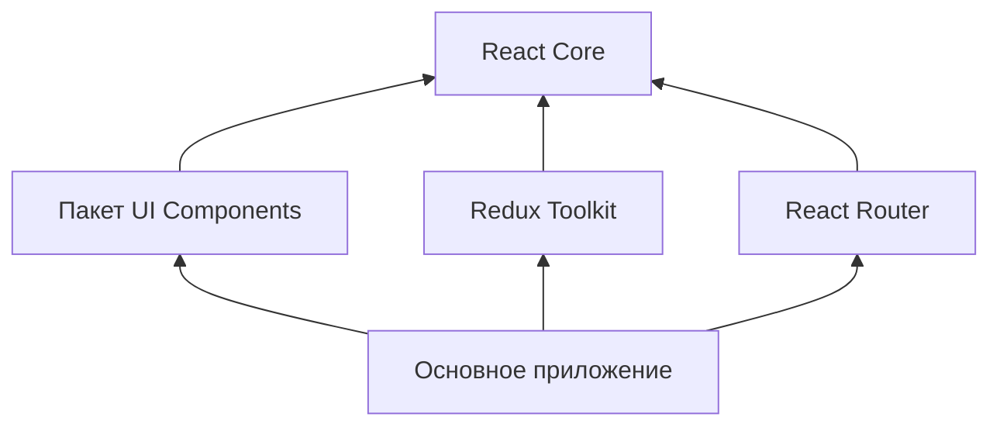

---

## 6. Диаграмма состояний (State Diagram)

Используется для моделирования жизненного цикла объекта.

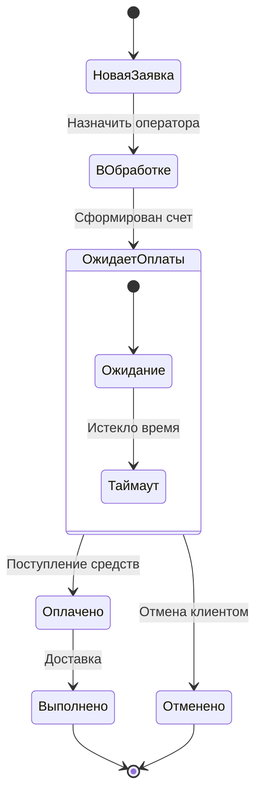

---

## 7. Карта путешествия пользователя (User Journey)

Помогает оценить UX-проблемы и зафиксировать этапы работы пользователя с продуктом.

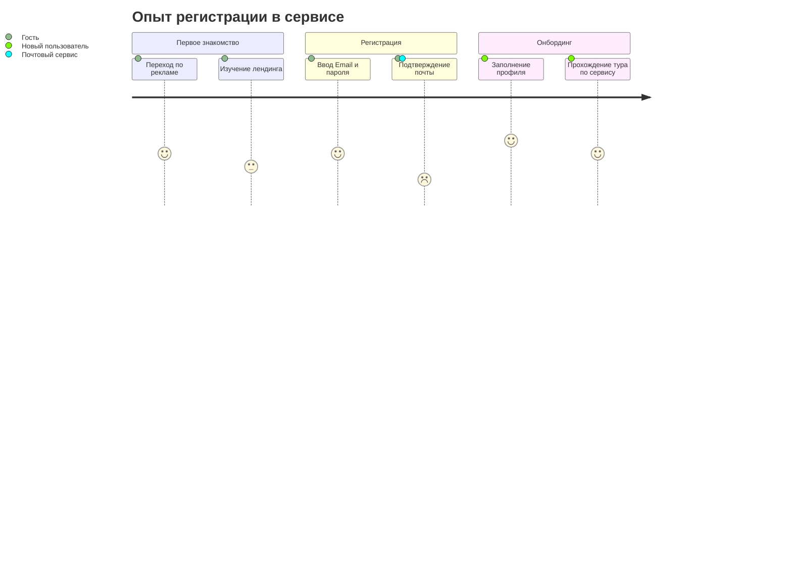

---

## 8. Стилизация элементов

С помощью `classDef` можно гибко настраивать цветовую гамму узлов.

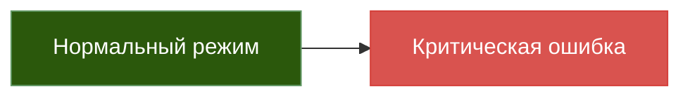

---

## 9. Круговая диаграмма (Pie Chart)

Подходит для отображения распределения долей или статистики.

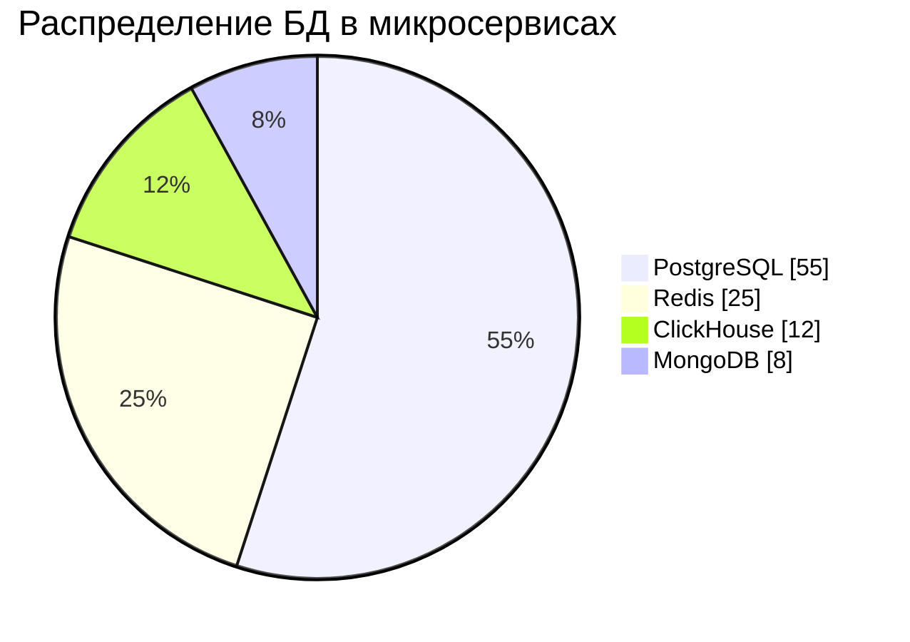
